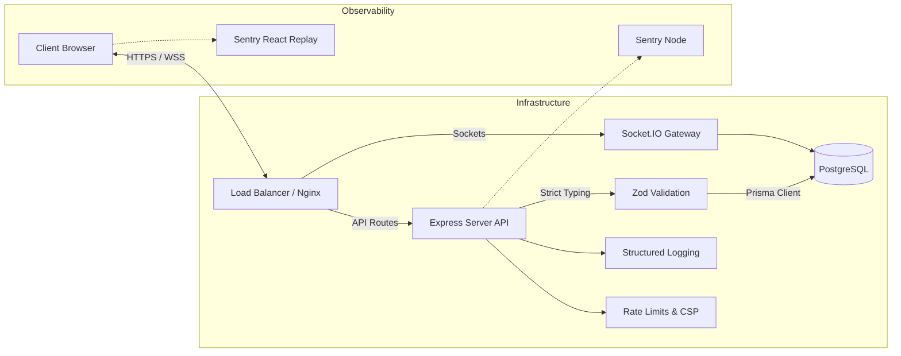
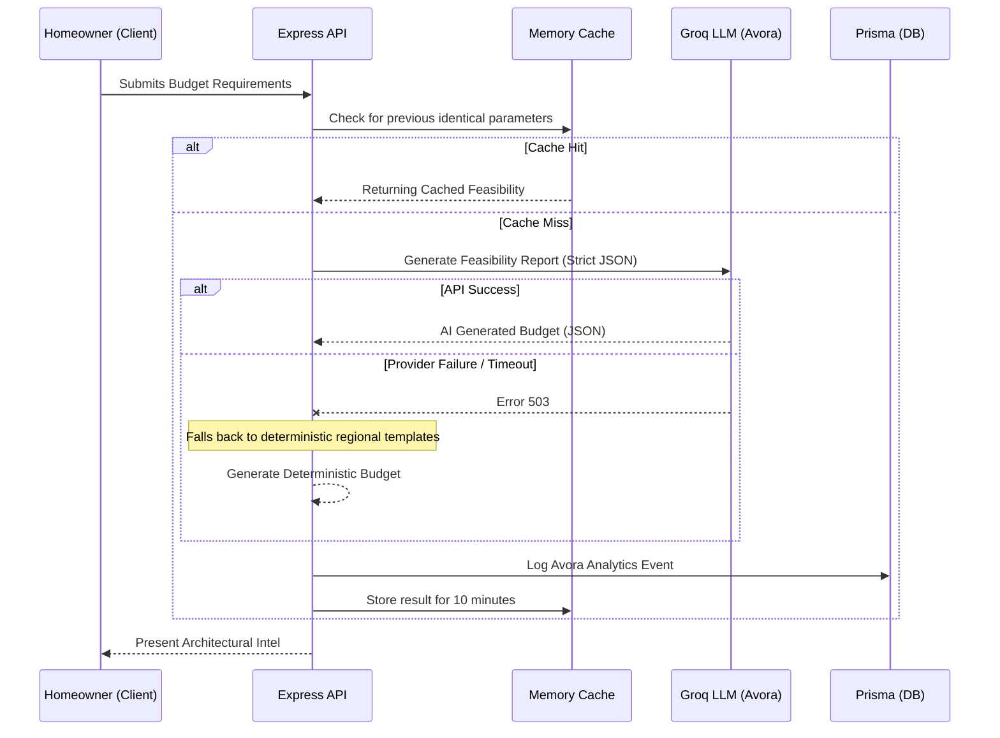
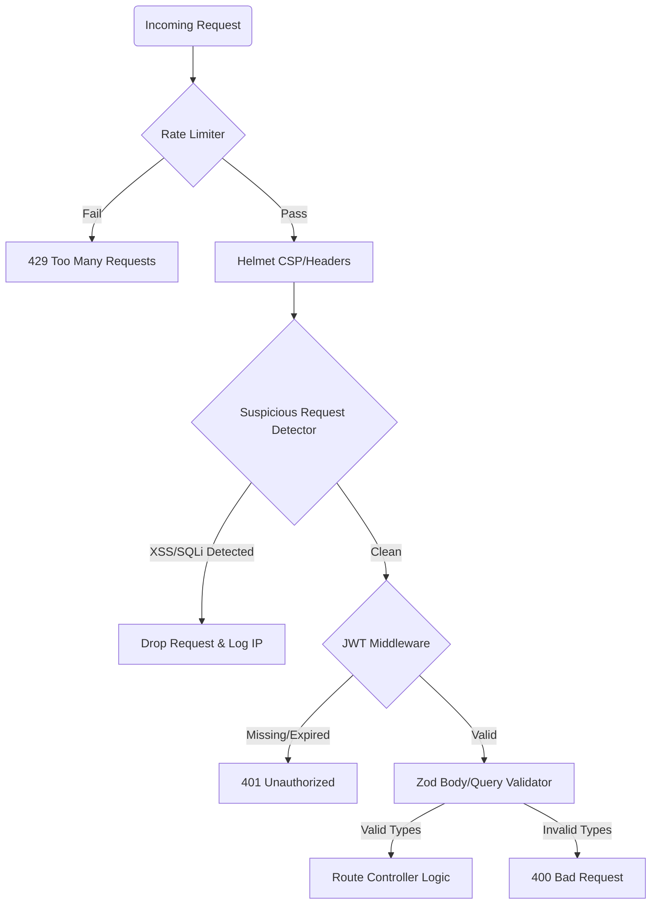
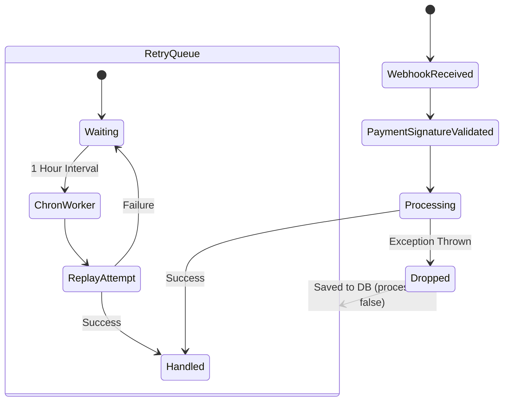

# DomeLink Architecture & Systems Design

This document details the underlying mechanics, workflows, and logical separation of concerns within the DomeLink ecosystem.

## 1. High-Level Request Flow
The architecture relies on an Express-based Node.js backend mediating secure connections to PostgreSQL while delegating active eventing to Socket.io. The React frontend interacts with these services via strongly typed endpoints.

## 2. Avora AI Orchestration Workflow
To prevent architectural hallucinations and maintain budget accuracy, the Avora AI service utilizes a "Cache-First, Fallback-Secure" methodology.

## 3. The Trust & Security Layer
Because DomeLink acts as a high-value marketplace, enterprise-grade protection is baked into the request cycle before any controller logic executes.

## 4. Webhook Resilience Pipeline
Payment reconciliation relies on webhooks that can occasionally fail due to race conditions or database locks. DomeLink utilizes a passive-recovery chron worker.

