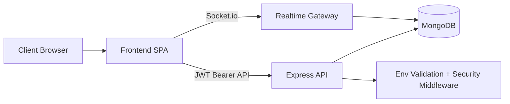

# DomeLink Monorepo

DomeLink is a premium full-stack architecture marketplace with JWT auth, recommendations, saved architects, structured consultations, realtime chat, team workspace, 3D interactions, and internal analytics.

## Stack

- `frontend/`: Vite + React 18 + TypeScript + Tailwind + shadcn/ui + Framer Motion + React Query + React Three Fiber
- `backend/`: Node.js + Express + TypeScript + MongoDB/Mongoose + JWT + Zod + Socket.io

## Architecture Diagram



## Quick Start

### 1) Backend

```bash
cd backend
npm install
cp .env.example .env
npm run dev
```

Runs at `http://localhost:5000`.

### 2) Frontend

```bash
cd frontend
npm install
cp .env.example .env
npm run dev
```

Runs at `http://localhost:8080`.

### 3) Seed Data

```bash
cd backend
npm run seed
```

## Environment Variables

### Backend (`backend/.env`)

- `NODE_ENV` (`development|test|production`)
- `PORT`
- `MONGODB_URI`
- `JWT_SECRET`
- `JWT_EXPIRES_IN`
- `FRONTEND_URL`

### Frontend (`frontend/.env`)

- `VITE_API_BASE_URL`

Both backend and frontend perform startup-time env validation.

## API Surface

- Auth: `/api/auth/register`, `/api/auth/login`, `/api/auth/me`
- Architects: `/api/architects`, `/api/architects/:slug`, `/api/architects/me`
- Recommendations: `/api/recommendations`
- Saved: `/api/saved`, `/api/saved/:architectId`, `/api/saved/my`
- Consultations: `/api/consultations`, `/api/consultations/my`
- Chat: `/api/chat/:consultationId`
- Team: `/api/team`, `/api/team/invite`, `/api/team/:architectId/invites`, `/api/team/invite/:token/accept`
- Analytics: `/api/analytics`, `/api/analytics/summary`

## Quality Commands

```bash
# frontend
npm run lint --prefix frontend
npm run test --prefix frontend
npm run build --prefix frontend

# backend
npm run lint --prefix backend
npm run build --prefix backend
```

## Production Readiness Notes

- Helmet, CORS controls, and auth/API rate limiting are enabled.
- Mongo indexes exist for architects, consultations, chat, and analytics paths.
- Structured backend error logging is centralized in middleware.
- Route-level splitting and chunk strategy are configured in Vite.
